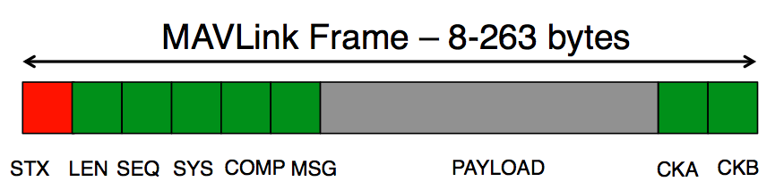

## Что такое MAVLink?

__MAVLink__ или Micro Air Vehicle Link — это протокол информационного взаимодействия с дронами или малыми беспилотными аппаратами. Позволяет общаться станциям с дронами и дронам с дронами.

Данные по протоколу передаются в виде пакетов (frame). Этими данными могут быть телеметрия, статусы по отдельным модулям устройства и т.п. Протокол работает поверх любых программных и аппаратных средств, реализующих последовательную передачу данных. То есть фреймы MAVLink можно упаковать в TCP фрейм для передачи по сети или передавать по UART. 

Сейчас поддерживаются две версии протокола v1 и v2. Главное отличие версий v1 и v2 протокола заключается в длине пакета и его служебных полях.

> Протокол реализован в формате библиотек на разных языках программирования, в том числе на С. Вариант для С выполнен в виде only-headers библиотеки. 

[Ссылка на репозиторий с библиотекой для v1](https://github.com/mavlink/c_library_v1/tree/master).

[Ссылка на репозиторий с библиотекой для v2](https://github.com/mavlink/c_library_v2/tree/master). 

### MAVLink 1

В этой версии, служебные байты в пакете занимают только 8 байт:
- Первый байт пакета (__STX__) — это символ начала пакета:
0xFD для версии v2.0,
0xFE для версии v1.0
- `__LEN__` — длина информационной части пакета.
- __SEQ__ — счётчик пакета (0-255), который поможет выявить потерю сообщения.
- __SYS__ (System ID) — идентификатор отправляющей системы.
- __COMP__ (Component ID) — идентификатор отправляющего компонента.
- __MSG__ (Message ID) — тип сообщения, от него зависит, какие данные будут лежать в информационной части пакета.
- __PAYLOAD__ — информационная часть пакета: сообщение, размером от 0 до 255 байт.

- Два последних байта пакета — __CKA__ и __CKB__, нижний и верхний байт, соответственно, содержат контрольную сумму пакета.

*Структура пакета MAVLink 1*

Максимальная длина пакета 263 байта.

__Недостатки__: всего доступно 256 различных команд, нет возможности создания собственных служебных полей (только в информационной части).

__Преимущества__: однозначная совместимость с любыми устройствами MAVLink любых версий.

### MAVLink2

Структура основного пакета такая же, что и в v1. Максимальная длина пакета 280 байт.

__Недостатки__: лишь частичная совместимость с MAVLink 1 (все старые поля буду считаны, но команды из новых полей не будут выполнены)

__Преимущества__: создание собственных служебных полей, поддержка больше чем 256 команд

__Сейчас активно поддерживаются обе версии протокола.__

### Полезное

>С помощью команды  `Heartbeat` происходит проверка подключения устройств, участвующих в общении, с частотой 1 Гц.

>[MAVLink Developer Guide](https://mavlink.io/en/)

>[Краткое описание фрейма на русском](https://rcsearch.ru/wiki/MAVLink)

>[Краткое сравнение v1 и v2 от Ardupilot](https://ardupilot.org/dev/docs/mavlink-basics.html)

>[Статья про MAVLink на русском](https://habr.com/ru/articles/312300/)
